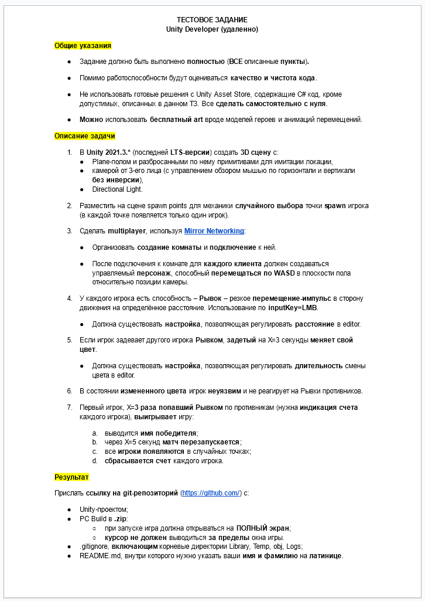

# Тестовое задание HB

## Исходный текст задания:

# Итоги

Дедлайн - неделя, исход такой: несмотря на то, предложенный срок кажется адекватным (не 3 дня как у некоторых), результаты, все равно, не полностью удовлетворяют ТЗ. Срок может быть достаточным для выполнения задания и демонстрации владения предметом, если бы предложенный в задаче плагин был бы мне известен или лучше документирован или хотя бы работал. В выполнении хотелось продемонстрировать основные вопросы связанный с реализацией такого типа заданий в части управления ресурсами, графического оформления пользовательского интерфейса и сцены, и структурирования кода по задаче. Сложность выполнения связана с тем, что предложенный в задаче плагин - сырой и плохо документирован, по этому нет другой альтернативы для работы, за исключением изучения, отладки и модификации кода плагина.

Предоставленная реализация в виду ограниченного времени на завершение работы, а так же в связи с тем, что не предполагалась командная разработка, реализован с использованием методов, ускоряющих реализацию, но относительно сложных в дальнейшем сопровождении, по этому, реализацию нужно рассматривать как прототип или MVP. Среди таковых методов: публичные поля общих данных без контроля целостности; композиция, основанная на домене VM, хотя синглтоны и не имеют связи с объектом для облегчения тестирования; не строгая реализация паттернов в части управления сетевым протоколом или в части пользовательского интерфейса. По этому, реализация служит способом обозначения (даже не предложения решения) вопросов, связанных с производством качественного продукта по задаче, соответствующего требованиям надежности, сопровождения и удовлетворенности от использования.

Трудности, связанные с использованием плагина заключаются в том, что реализованная модель не полна и в части понятий не однозначна, например в рамках предлагаемого плагином решения, точно не ясно, что такое клиент и сервер. Кроме того не уделяется должного внимания полному циклу жизни объектов композиции плагина, в следствие чего возникают проблемы с использованием и работоспособностью, такие как: часто нет возможности управлять уничтожением или завершением работы объектов, а так же обрабатывать финишные события. Это выливается в проблемы с функционированием самого плагина, в том числе связанные с многопоточностью и управлением сокетами. Применение аспектного программирования, в условиях многократной последовательной компиляции, считаю нежелательным, т.к. итоговый результат сборки непредсказуем в связи с особенностями компиляции, такими как оптимизация например. В реализации плагина уделяется внимание вопросам, не относящимся к зоне ответственности задачи, которую плагин решает, (например: управление ресурсами). Туда же в кучу - ошибки, которые имеет сам движок, влияющие на работу плагина, по этому, необходима отдельная от платформы движка реализация.

У меня все это вылилось в то, что в течение рабочего дня, работая над задачей я получил повторные вызовы Discovery (очень простой протокол), и далее, зависания в цикле клиента, ожидающего ответа сервера или возможно отсутствие такового ответа при корректной работе фабрикатора объекта ответа. В процессе инцидента, компонент не изменялся. К сожалению, далее чем Discovery, я не продвинулся, хотя с последующей реализацией так же были проблемы, например связанные с созданием префабов с компонентами плагина. В итоге я потратил два дополнительных дня на изучение кода и пришел к выводам, описанным выше.

Все вышеперечисленное можно подытожить как: во-первых, плагин нужно переписывать; во-вторых, плохо понятны цели задания, и времени на его решение все равно не много. По окончании срока выполнения, считаю работу неудачной. Возможно вернусь к ней в будущем, в том числе, если будет выделено дополнительное время на решение.
